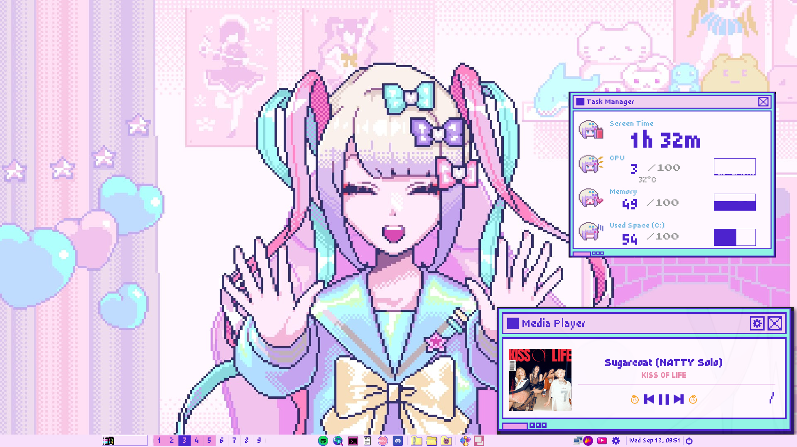
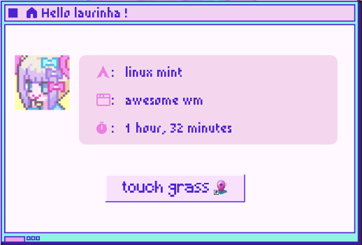
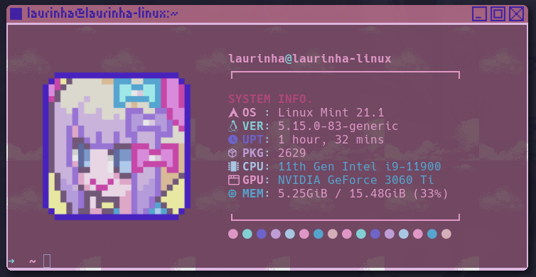
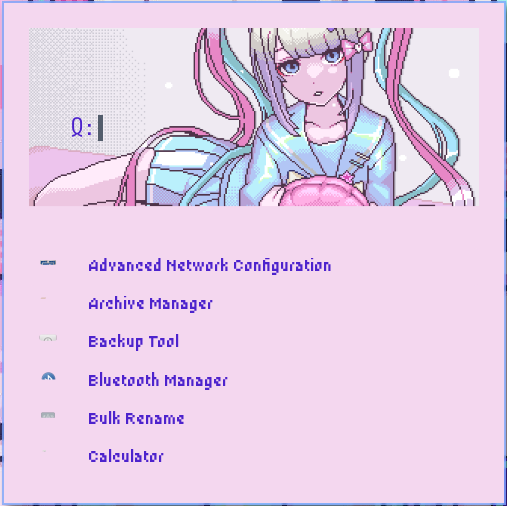

# NSO DOTFILES

Desktop Environment built to emulate NSO's game UI. This project was made using Amitabha37377's [Awful-DOTS](https://github.com/Amitabha37377/Awful-DOTS) as a base (since I had no previous knowledge in Lua).

## 💻 Built with

Technologies used in the project:
* OS: Linux Mint
* WM: AwesomeWM (stable)
* GTK Theme: Catppuccin Mocha
* File Manager: Nemo
* Shell: ZSH
* Terminal: Kitty

## Screenshots

